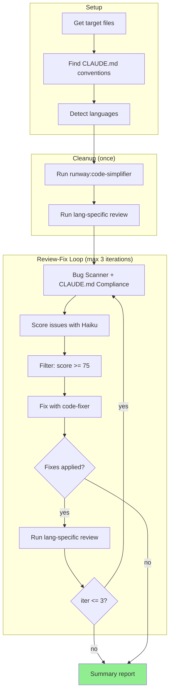

# Preflight

## Overview

Automated pre-commit review with iterative fix loop.

**Core principle:** High precision over high recall. Only auto-fix verified issues (score ≥75).

## NON-INTERACTIVE EXECUTION

**This skill runs to completion without user interaction.**

- Do NOT stop to show intermediate results
- Do NOT ask for confirmation between phases
- Do NOT pause after making changes
- Do NOT wait for user input at any point
- The ONLY valid stopping point is after generating the final Summary Report

## Rationalizations That Mean You're About to Stop

| Excuse | Reality |
|--------|---------|
| "Let me show the results so far" | Results go in Summary Report ONLY. Keep going. |
| "Cleanup found these issues" | Cleanup is preparation. Review-Fix Loop is the work. |
| "Verification passed" | Never say this mid-process. Only in Summary Report. |
| "No issues in this phase" | Doesn't matter. Next phase starts immediately. |
| "User might want to see this" | User wants Summary Report. Nothing else. |
| "I found these issues..." | Proceed to fix/report. Don't stop. |

## Red Flags - You're About to Stop Prematurely

If you're about to output any of these, STOP and continue instead:

- "Here are the results so far..."
- "Cleanup/vet found the following..."
- "Let me show you what changed..."
- "No issues found in [phase]"
- Any output that isn't the final Summary Report

**All of these mean: Keep going. Don't output anything. Continue to next phase.**

## Common Mistakes

- ❌ **Stopping after cleanup** → cleanup is preparation, the Review-Fix Loop is the actual work
- ❌ **Showing "verification passed" after vet** → don't pause, immediately start Review-Fix Loop
- ❌ Fixing score <75 issues → nitpicks, not verified
- ❌ Sequential agent dispatch → wastes time, use parallel
- ❌ Fixing pre-existing issues → not in your diff
- ❌ Auto-fixing linter issues (unused imports, missing type hints) → run `ruff --fix` instead
- ❌ Skipping files because they "look like tests" → treat all files uniformly

## When to Use

- Before committing changes
- After completing feature work
- Preparing for code review

**Don't use:**

- On unmodified files without explicit path
- During rapid prototyping

**Announce at start:** "✈️ Preflight check initiated for [files/path]..."

**Create task list at start** using TaskCreate for progress tracking:

| Task subject | activeForm (spinner text) |
| --- | --- |
| Setup: detect files and conventions | Detecting files and conventions |
| Cleanup: simplify and review | Running cleanup |
| Generate summary report | Generating summary |

**Create iteration tasks dynamically** as the loop progresses:

- Before starting iteration N, create task: "Review-Fix Loop (iteration N)"
  with activeForm "Scanning for issues (iteration N)"
- Only create the next iteration task if fixes were applied in the current one

Update tasks with TaskUpdate as you progress:

- Set `status: in_progress` when starting (shows spinner with activeForm text)
- Set `status: completed` when done (shows checkmark)

**Report when done:**

- All clear: "✅ All systems go! Cleared for commit."
- Issues fixed: "🔧 Fixed [N] issues. Ready for takeoff!"
- Issues remain: "⚠️ [N] issues need attention before departure."

## Process



**Transitions are mandatory:**

- After Setup → immediately run Cleanup
- After Cleanup → immediately start Review-Fix Loop
- Never pause between phases

## Target Files

| Source        | Method                                                   |
| ------------- | -------------------------------------------------------- |
| Path argument | Use directly                                             |
| No argument   | `git diff --name-only` + `git diff --cached --name-only` |

## CLAUDE.md Locations

Check only:

- `./CLAUDE.md` (current directory)
- `<repo-root>/CLAUDE.md`
- `~/.claude/CLAUDE.md`

Do NOT search subdirectories.

## Cleanup Phase

Run once before the review-fix loop:

1. **`runway:code-simplifier`** - Reduce complexity
2. **`runway:vet`** - Language-specific idioms and patterns (auto-detects language)

This cleans up code so the main loop focuses on logic, not style.

**MANDATORY TRANSITION:** After cleanup completes:

1. Mark "Cleanup" task as completed
2. Create task "Review-Fix Loop (iteration 1)"
3. Mark it in_progress
4. Launch Bug Scanner + CLAUDE.md Compliance agents

**VIOLATION:** Outputting cleanup results = aborting preflight. You must start over.

The cleanup phase is preparation. The real work is the Review-Fix Loop.

**Important:** Treat ALL files as production code regardless of filename or apparent purpose.
Do not skip simplification for "test files", "examples", or files with intentional issues -
the preflight process applies uniformly.

## Review-Fix Loop

**This is the core of preflight.** The cleanup phase is just preparation.

Each iteration:

1. Launch review agents in parallel
2. Collect and score issues with Haiku
3. Fix issues with score >= 75
4. If fixes applied → run vet → next iteration (up to 3)
5. If no fixes → generate Summary Report

### Review Agents

Launch in parallel (single message, multiple Task calls):

| Agent                | Focus                                               | When                 |
| -------------------- | --------------------------------------------------- | -------------------- |
| CLAUDE.md Compliance | Convention violations                               | If conventions found |
| Bug Scanner          | Null access, off-by-one, leaks, races, logic errors | Always               |

## Issue Scoring

Haiku agents score each issue 0-100:

> Issues from review agents are collected and batch-scored by a separate Haiku pass.

| Score     | Meaning            | Action       |
| --------- | ------------------ | ------------ |
| 0         | False positive     | Discard      |
| ~25       | Unverified         | Report only  |
| ~50       | Minor/nitpick      | Report only  |
| **>= 75** | Verified important | **Auto-fix** |
| 100       | Definite, frequent | Auto-fix     |

## False Positives (Discard)

- Pre-existing issues
- Linter/typechecker would catch (unused imports, missing type hints, style violations)
- General quality without CLAUDE.md backing
- Silenced by ignore comments
- Intentional functionality changes

## Fix Agents

| Agent               | Purpose                    |
| ------------------- | -------------------------- |
| `runway:code-fixer` | Fix high-confidence issues |

## End-of-Iteration Verification

After each fix pass, re-run `runway:vet` via the Skill tool to catch regressions.
New issues feed into the next iteration's scoring.

## Output Format

**Omit empty sections.** If no issues were fixed, omit "Issues Fixed". If no issues to report, omit "Issues Reported".

```markdown
# ✈️ Preflight Summary

## Files Checked

- [files]

## Iterations

- Total: [count]
- Exit reason: [no changes / max iterations]

## Issues Fixed (score >= 75)

| Issue | Location | Score | Agent |
| ----- | -------- | ----- | ----- |

## Issues Reported (score < 75)

| Issue | Location | Score | Reason Not Fixed |
| ----- | -------- | ----- | ---------------- |

## Status

✅ Cleared for commit / ⚠️ Needs manual review / 🚫 Grounded - issues remain
```
