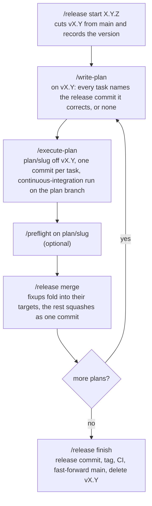
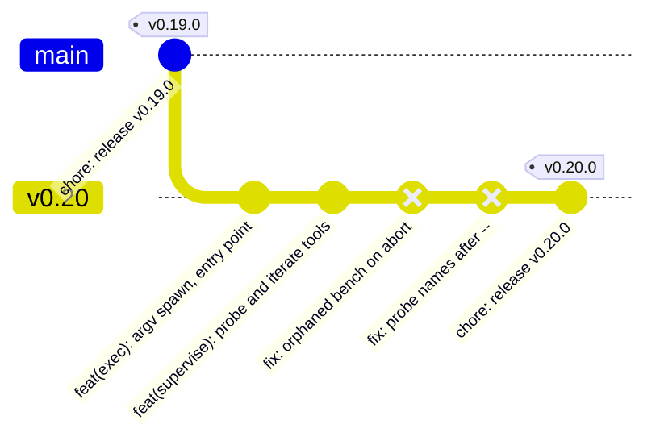

# Plan and release flow

How work moves from an approved plan to a tag on `main`, which command does each git write, and what
stops the assistant from doing any of it by hand. The assistant plans and implements; you run the
four `/release` commands.

**What this doc covers:** [the branches](#the-branches), [starting a release](#starting-a-release),
[the loop](#the-loop), [one plan, one commit](#one-plan-one-commit),
[folding fixes into the commits they correct](#folding-fixes-into-the-commits-they-correct),
[finishing a release](#finishing-a-release), [what enforces it](#what-enforces-it), and
[recovering](#recovering).

**What this doc does not cover:** the plan template and task wording (`write-plan`), the task loop's
gates and reports (`execute-plan`), or the version-bump and changelog mechanics (`write-release`).
This doc covers only where each one writes to git.

## The branches

| Branch          | Who creates it         | What lands on it                                            |
| --------------- | ---------------------- | ----------------------------------------------------------- |
| `main`          | —                      | Release branches, fast-forwarded by `/release finish`       |
| `vX.Y`          | `/release start X.Y.Z` | One squash commit per plan, then the release commit and tag |
| `plan/<slug>`   | `/execute-plan`        | One commit per task, findings fixes, CI fixes               |
| `fix-ci/<slug>` | `/fix-ci`              | Attempts to make a red run green, squashed back when it is  |

The script finds a release branch by its config key, `branch.vX.Y.release = X.Y.Z`, never by its
name. A plan branch records the branch it was cut from as `branch.plan/<slug>.planBase`; that is
where `/release merge` lands it. A plan cut from `main` while no release is open lands on `main` the
same way.

## Starting a release

`/release start X.Y.Z` refuses unless you are on `main`, the tree is clean, `vX.Y` does not already
exist, `main` equals `origin/main` after a fetch, and no branch already carries the `release` key.
It then cuts `vX.Y` from `main`, records the version on it, and pushes.

`--adopt` marks the branch you are on as the release instead of cutting one. It refuses on `main`
itself, and on a branch that does not contain `main`. An existing branch becomes a release branch
with `/release start X.Y.Z --adopt`, which writes the key without cutting or pushing.

A `start` whose push failed is resumed by running the same `/release start X.Y.Z` again, which
refuses once origin already has the branch — see [Recovering](#recovering).

## The loop

One release is one pass of this loop: `/release start`, then per plan `/write-plan`,
`/execute-plan`, optionally `/preflight`, and `/release merge`, repeating until `/release finish`
ships it. `/release status` answers "where are we" at any point.

`/release status` is the one subcommand that needs no marker: its first line is `release: <branch>
<version>` or `release: none`, and `write-plan` reads it to know which release a plan will land on.

## One plan, one commit

`/execute-plan` runs on `plan/<slug>`, never on the branch it started from. Every task commits on
the plan branch when its verification passes. At the end it pushes the branch once through
[`fix-ci-push.sh`](../scripts/fix-ci-push.sh) and watches the branch's CI run. It then writes the
squash message under `.git/plan-squash/` and reports the one command left for you: `/release merge`.

`/release merge` acts on the checked-out plan branch, or on one named as `plan/<slug>`. It refuses,
and changes nothing, unless:

- HEAD names a branch, when none is given on the command line — a detached HEAD refuses;
- that branch is under `plan/*`, and is a local branch;
- the branch's `planBase` key is set — an unset key refuses rather than falling back to `main`;
- the tree is clean;
- the plan branch's recorded base exists, is an ancestor of the plan branch tip, and matches its
  origin copy after a fetch;
- the plan branch matches its own origin copy, when origin has one. This reads the remote-tracking
  ref as the last fetch or push left it and never fetches the plan branch itself, so an unfetched
  copy on origin does not block, and a stale tracking ref is cleared with a fetch;
- the branch is linear: no merge commit, and no `squash!` or `amend!` commit, neither of which a
  scripted replay can carry;
- the branch tip's CI run concluded success (`--force` skips this gate);
- the squash message exists, when the branch has commits that are not `fixup!` — an all-`fixup!`
  branch needs none. `--force` also lets the skill compose and write a missing message itself, only
  when the branch has non-fixup commits; a message that already exists is never rewritten.

On a branch with no `fixup!` commits it squash-merges the branch onto its base as one commit whose
message is the file, pushes the base, and deletes the plan branch locally and on origin.

## Folding fixes into the commits they correct

A later plan in the release fixes a defect an earlier plan shipped. Fixed the plain way, each fix
becomes a commit after the plan commits, so history reads "shipped broken, then patched". The flow
folds those fixes back into the commits they correct instead.

The two `fix:` commits, `fix: orphaned bench on abort` and `fix: probe names after --`, are what
folding removes. After the fold the release branch carries the two feature commits, each containing
its fix, then the release commit.

The mapping lives on the plan branch, not in the plan file:

1. **`write-plan` derives a target per task.** For each task it runs `git log $(git merge-base main
   vX.Y)..vX.Y --format=%s -- <the task's files>`. One subject answers → the task's **Folds into**
   line names it; none → `none`; several → it splits the task along the file boundary, and a file
   touched by several release commits takes the newest. It lists every non-`none` target once in the
   plan's `## Folds` section, and the approval message quotes that section first, opening with "This
   plan rewrites `vX.Y`". A target is a subject, never a hash: autosquash matches by subject, and a
   hash changes after the first fold.
2. **`execute-plan` commits a targeted task as a fixup.** Right before the commit it looks the
   subject up on the recorded base and runs `git commit --fixup=<sha>`, which generates the message
   `fixup! <subject>`. A `none` task commits with a composed message. Defects the plan's own final
   verification confirms in an earlier release commit fold the same way, and the ship report names
   them.
3. **`/release merge` folds.** On a branch holding `fixup!` commits it requires the base to carry
   the `release` key, each fixup subject to match exactly one commit on the release branch, and no
   other plan branch to record the same base. It then runs `git rebase --autosquash` on the plan
   branch and moves the release branch back onto the replayed release commits. It locates them by
   counting: a subject can repeat, and the replay drops any commit whose change the fold already
   made. It then squashes whatever ordinary commits remain as one commit, pushes the release branch
   with `--force-with-lease` against the sha it fetched at the start, and prints the pre-fold tip. A
   conflicting fixup aborts the rebase and refuses with both branches as they were. The script
   refuses the same way when a replay ends with fewer release commits than it started with. When a
   fixup cancels a release commit out, you apply it by hand instead.

Two constraints follow. A fixup replays right after the commit it names, before any of the plan's
own commits, so a task that depends on another task's work cannot fold; `write-plan` keeps each task
self-contained. And folding rewrites the release branch, so it is refused on a base without the
`release` key: `main` is never rewritten.

## Finishing a release

`/release finish` is four steps: three script calls around the release commit, with `write-release`
running between the first and second — the one step with confirmations, while the marker is down.

1. `finish --check` refuses unless:
   - you are on the release branch with a clean tree;
   - no unmerged plan branch records it as base; a plan branch whose commits the release already
     contains is ignored;
   - it matches its origin copy and `main` matches `origin/main`, after a fetch;
   - `main` can fast-forward to it.

   It prints the version.

2. `write-release` bumps the version, moves the changelog, commits `chore: release vX.Y.Z`, and tags
   `vX.Y.Z` on the release branch. Its two confirmations are yours.
3. `finish --push` refuses unless the tip is the release commit: tagged `vX.Y.Z`, with the subject
   `chore: release vX.Y.Z`. It pushes the branch. The skill then watches the CI run for the pushed
   tip, unless `--force` was given; red ends the turn with the conclusion and nothing is published.
4. `finish --publish` re-runs every `--check` precondition plus the CI gate and the tag-at-tip
   check. It then fast-forwards `main`, pushes `main` and the tag, deletes the release branch
   locally and on origin, and removes its key. `--gh-release` creates the GitHub release from the
   changelog section only after the tag push. `--force` skips the CI gate. A missing `gh`, a missing
   changelog section, or a release that already exists warns rather than failing, so the publish
   still succeeds; the warnings are worth reading.

`finish --publish` fast-forwards `main`, never merges it: the branch shows the plan commits and the
tag on its tip, so `git log main` reads as the changelog.

## What enforces it

- `git config claude.protectMain true` makes [`git-guard.sh`](../hooks/git-guard.sh) block every
  commit-creating command on `main`. `/setup-py` and `/setup-ts` set it.
- [`release.sh`](../scripts/release.sh) runs only while a fresh `release-active` marker exists, one
  raised in the last thirty minutes; an older marker, or one dated ahead by a skewed clock, reads as
  absent and the script refuses. Both the guard and the script check the same marker. Its writes,
  the leased force-push included, happen inside the script where the guard does not look, which is
  why the invocation itself is marker-gated. A typed `git push --force` stays blocked under every
  marker.
- Branch pushes go through [`fix-ci-push.sh`](../scripts/fix-ci-push.sh): append-only, no force, and
  only `fix-ci/*` and `plan/*` branches may be deleted.
- The CI templates trigger on `main`, `plan/**`, `fix-ci/**`, and `v[0-9]*` pushes, so a plan branch
  is green before it lands and a release branch has a run for `finish` to gate on. Projects pick the
  trigger up on `/setup-py update` or `/setup-ts update`.

## Recovering

Every refusal exits 2 and leaves the repo as it was found, with one exception below. A failure after
a write exits 1 and names what was kept, so the run can be retried once the cause is fixed.

Every fold failure up to the push restores itself. The script puts `vX.Y` and `plan/<slug>` back at
their pre-fold tips, names the ones it moved back, clears the working tree, and leaves the squash
message in place, so a re-run after the cause is fixed folds again. That covers:

- a push origin rejected because it moved,
- a remote that cannot be reached,
- a base the fold cannot be moved onto, or cannot be switched to once moved,
- a squash that cannot be committed,
- a replay that cancels a release commit out.

The script prints the two pre-fold shas only when that restore fails too, each next to the `git
branch -f` command that recovers it.

The exception is a conflicting replay whose `git rebase --abort` fails as well. That run exits 1
saying the repo is mid-rebase and restores nothing; finish or abort the rebase by hand, then re-run.

Fixing the cause means more than a fetch when the push was rejected because origin moved: the
restore puts `vX.Y` back at its pre-fold tip, which a re-run then refuses as differing from origin.
The rejection names the way through — catch `vX.Y` up to origin, rebase `plan/<slug>` onto it, then
re-run — and prints the two commands that do it.

Once the push lands, the fold stands. The cleanup that follows it deletes `plan/<slug>` here and on
origin; it exits 1 naming what is left to remove by hand and says the release branch is already
pushed. A squash that cannot be pushed restores its base the same way a fold does. You finish a
`start` whose push failed by running the same `/release start X.Y.Z` again — see
[Starting a release](#starting-a-release).

After a fold that did land, the success line prints the release branch's pre-fold tip; `git branch
-f vX.Y <sha>` undoes it for as long as the reflog keeps the commits, thirty days by default.
