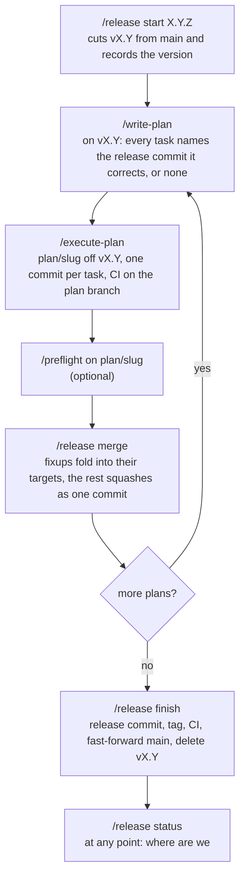
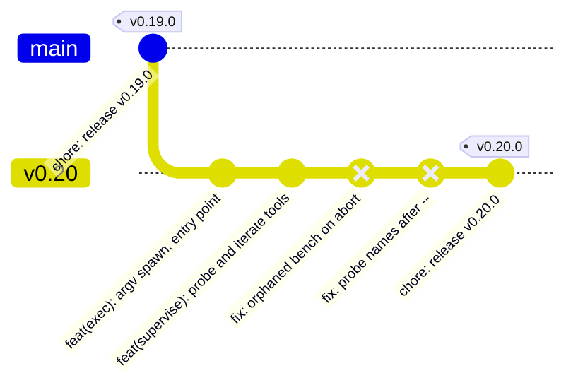

# Plan and release flow

How work moves from an approved plan to a tag on `main`, which command does each git write, and what
stops the assistant from doing any of it by hand. The assistant plans and implements; you run the
four `/release` commands.

**What this doc covers:** [the branches](#the-branches), [the loop](#the-loop),
[one plan, one commit](#one-plan-one-commit),
[folding fixes into the commits they correct](#folding-fixes-into-the-commits-they-correct),
[finishing a release](#finishing-a-release), [what enforces it](#what-enforces-it), and
[recovering](#recovering).

**What this doc does not cover:** the plan template and task wording (`write-plan`), the task loop's
gates and reports (`execute-plan`), or the version-bump and changelog mechanics (`write-release`).
This doc covers only where each one writes to git.

## The branches

| Branch          | Who creates it         | What lands on it                                            |
| --------------- | ---------------------- | ----------------------------------------------------------- |
| `main`          | —                      | Release branches, fast-forwarded by `/release finish`       |
| `vX.Y`          | `/release start X.Y.Z` | One squash commit per plan, then the release commit and tag |
| `plan/<slug>`   | `/execute-plan`        | One commit per task, findings fixes, CI fixes               |
| `fix-ci/<slug>` | `/fix-ci`              | Attempts to make a red run green, squashed back when it is  |

A release branch is known by its config key, `branch.vX.Y.release = X.Y.Z`, never by its name. A
plan branch records the branch it was cut from as `branch.plan/<slug>.planBase`; that is where
`/release merge` lands it. A plan cut from `main` while no release is open lands on `main` the same
way.

## The loop

One release is one pass of this loop: `/release start`, then per plan `/write-plan`,
`/execute-plan`, optionally `/preflight`, and `/release merge`, repeating until `/release finish`
ships it. `/release status` answers "where are we" at any point.

`/release status` is the one subcommand that needs no marker: its first line is `release: <branch>
<version>` or `release: none`, and `write-plan` reads it to know which release a plan will land on.

## One plan, one commit

`/execute-plan` runs on `plan/<slug>`, never on the branch it started from. Every task commits on
the plan branch when its verification passes. At the end it pushes the branch once through
[`fix-ci-push.sh`](../scripts/fix-ci-push.sh) and watches the branch's CI (continuous integration)
run. It then writes the squash message under `.git/plan-squash/` and reports the one command left
for you: `/release merge`.

`/release merge` refuses, and changes nothing, unless:

- the tree is clean;
- the plan branch's recorded base exists, is an ancestor of the plan branch tip, and matches its
  origin copy after a fetch;
- the plan branch matches its own origin copy, when origin has one;
- the branch tip's CI run concluded success (`--force` skips this gate only);
- the squash message exists, when the branch has commits that are not `fixup!` — an all-`fixup!`
  branch needs none.

On a branch with no `fixup!` commits it squash-merges the branch onto its base as one commit whose
message is the file, pushes the base, and deletes the plan branch locally and on origin.

## Folding fixes into the commits they correct

A later plan in the release fixes a defect an earlier plan shipped. Fixed the plain way, each fix
becomes a commit after the plan commits, so history reads "shipped broken, then patched". The flow
folds those fixes back into the commits they correct instead.

The two `fix:` commits, `fix: orphaned bench on abort` and `fix: probe names after --`, are what
folding removes. After the fold the release branch carries the two feature commits, each containing
its fix, then the release commit.

The mapping lives on the plan branch, not in the plan file:

1. **`write-plan` derives a target per task.** For each task it runs `git log $(git merge-base main
   vX.Y)..vX.Y --format=%s -- <the task's files>`. One subject answers → the task's **Folds into**
   line names it; none → `none`; several → the task is split along the file boundary, and a file
   touched by several release commits takes the newest. Every non-`none` target is listed once in
   the plan's `## Folds` section, and the approval message quotes that section first, opening with
   "This plan rewrites `vX.Y`". A target is a subject, never a hash: autosquash matches by subject,
   and a hash changes after the first fold.
2. **`execute-plan` commits a targeted task as a fixup.** Right before the commit it looks the
   subject up on the recorded base and runs `git commit --fixup=<sha>`, which generates the message
   `fixup! <subject>`. A `none` task commits with a composed message. Defects the plan's own final
   verification confirms in an earlier release commit fold the same way, and the ship report names
   them.
3. **`/release merge` folds.** On a branch holding `fixup!` commits it requires the base to carry
   the `release` key, each fixup subject to match exactly one commit on the release branch, and no
   other plan branch to record the same base. It then runs `git rebase --autosquash` on the plan
   branch, moves the release branch to the rewritten prefix, and squashes whatever ordinary commits
   remain as one commit. Then it pushes the release branch with `--force-with-lease` against the sha
   it fetched at the start and prints the pre-fold tip. A conflicting fixup aborts the rebase and
   refuses with both branches as they were.

Two constraints follow. A fixup replays right after the commit it names, before any of the plan's
own commits, so a task that depends on another task's work cannot fold; `write-plan` keeps each task
self-contained. And folding rewrites the release branch, so it is refused on a base without the
`release` key: `main` is never rewritten.

## Finishing a release

`/release finish` is three script calls around the release commit:

1. `finish --check` refuses unless:
   - you are on the release branch with a clean tree;
   - no plan branch still records it as base;
   - it matches its origin copy and `main` matches `origin/main`, after a fetch;
   - `main` can fast-forward to it.

   It prints the version.

2. `write-release` bumps the version, moves the changelog, commits `chore: release vX.Y.Z`, and tags
   `vX.Y.Z` on the release branch. Its two confirmations are yours.
3. `finish --push` refuses unless the tip is the release commit: tagged `vX.Y.Z`, with the subject
   `chore: release vX.Y.Z`. It pushes the branch. The skill then watches the CI run for the pushed
   tip, unless `--force` was given; red ends the turn with the conclusion and nothing is published.
4. `finish --publish` re-runs every `--check` precondition plus the CI gate and the tag-at-tip
   check. It then fast-forwards `main`, pushes `main` and the tag, deletes the release branch
   locally and on origin, and removes its key. `--gh-release` creates the GitHub release from the
   changelog section only after the tag push. `--force` skips the CI gate.

`main` is fast-forwarded, never merged: it shows the plan commits and the tag on its tip, so `git
log main` reads as the changelog.

## What enforces it

- `git config claude.protectMain true` makes [`git-guard.sh`](../hooks/git-guard.sh) block every
  commit-creating command on `main`. `/setup-py` and `/setup-ts` set it.
- [`release.sh`](../scripts/release.sh) runs only while the `release-active` marker `/release`
  raises exists, both at the guard and inside the script. Its writes, the leased force-push
  included, happen inside the script where the guard does not look, which is why the invocation
  itself is marker-gated. A typed `git push --force` stays blocked under every marker.
- Branch pushes go through [`fix-ci-push.sh`](../scripts/fix-ci-push.sh): append-only, no force, and
  only `fix-ci/*` and `plan/*` branches may be deleted.
- The CI templates trigger on `plan/**`, `fix-ci/**`, and `v[0-9]*` pushes, so a plan branch is
  green before it lands and a release branch has a run for `finish` to gate on. Projects pick the
  trigger up on `/setup-py update` or `/setup-ts update`.

## Recovering

Every refusal exits 2 and leaves the repo as it was found. A failure after a write exits 1 and names
what was kept, so the run can be retried once the cause is fixed. After a fold, the success line
prints the release branch's pre-fold tip; `git branch -f vX.Y <sha>` undoes it for as long as the
reflog keeps the commits, thirty days by default. An existing branch becomes a release branch with
`/release start X.Y.Z --adopt`, which writes the key without cutting or pushing.
